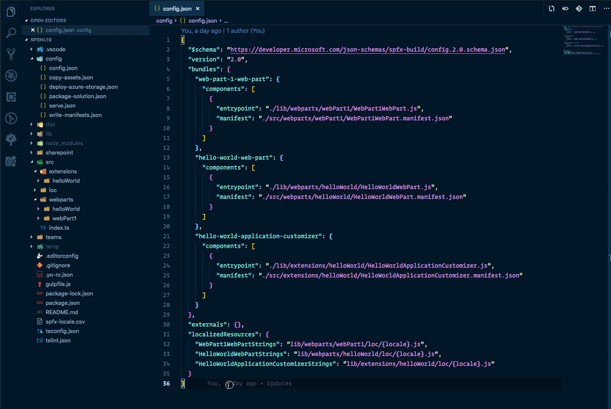

# SharePoint Framework Remove Component

This Visual Studio Code extension is intended to easily remove SharePoint Framework components from the current project you are working on. Normally when you want to remove a component, you will also have to do some manual changes to the config file of your project. This extension eliminates this task, so you can get back to developing much quicker.

## Usage

When you have this extension installed in VSCode, all you have to do is open the command prompt and type `SPFx: remove component`.

Steps:

- Start by opening the command prompt:
  - Windows `⇧+ctrl+P`
  - Mac: `⇧+⌘+P`
- Type: `SPFx: remove component`
- Will ask you if you are sure to remove a component when `git` is not enabled (optional)
- Select the component to remove, once selected it removes the component from your project

## Feedback and ideas

Feedback and ideas are always welcome. Please submit them via creating an issue in the project repository: [issue list](https://github.com/estruyf/vscode-spfx-remove-components/issues).